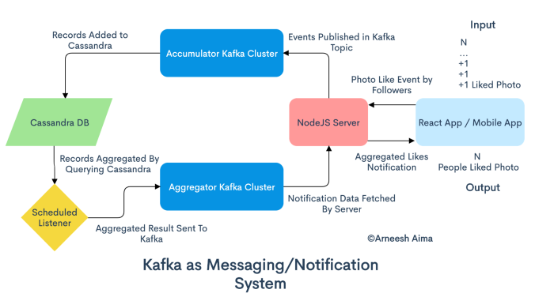

# A Data Streaming Notification Application.
Streaming data refers to data that is continuously generated, usually at high velocity and in high volumes. Such data is
often from  multiple sources. To ingest and process such a high load of real time data, a streaming data pipeline 
is needed. Apache Kafka is one platform that facilitates such an architecture. It is an open source distributed data 
streaming platform where one can publish, subscribe to a stream of records, store the records and process the stream of
records on the go.

A notification system with millions of notifications per hour would be a web application like Twitter.To implement such
an application one would need an asynchronous web server client like  a NodeJS or FAST API microservice. Such a client 
would then connect to the Kafka Producer API. As producer the web server client will be publishing messages to a Kafka 
cluster. Kafka at its core is basically a commit log where records are appended into sequentially and read in that order.
The said records are stored in structures called topics. As topics get huge they get broken into smaller partitions which
are then distributed among the servers(called brokers) in that kafka cluster. In such manner horizontal scalability is 
achieved and a high throughput assured as read/write speed remains unchanged with increase in volume. All the messages 
in each partition are still ordered sequentially and each can be distinguished by a unique key called an offset which is
incremented for with each new message. The purpose of an asynchronous web server client is to be able to publish the
messages to different topics according to their categories in real time. In twitter a category may be an hash tag 
with its own share of tweets being published to a topic.  

To ensure the fault tolerance of the system, partitions are instantly replicated among a number of brokers as they are 
created. Each partition has a 'leader' broker which is published into and subscribed from, and other 'follower' brokers 
which passively replicate it. If a 'leader' fails a 'follower' immediately steps into the role. Each broker is 'leader'
for some of its partitions and a 'follower' for others to ensure the load is well-distributed in the cluster. To enable 
a producer to find the correct 'leader' broker to publish into, a Zookeeper (a distributed key-value store) exists to 
keep track of the state of the entire cluster.

To read from the log Kafka avails a Consumer API. A consumer subscribes to certain topic. A consumer process know the
'leader' broker to read from by consulting the Zookeeper. In such manner, Apache Kafka facilitates a continuous stream 
of data from producer to broker to consumer. In our notification system, a consumer may be Kafka connector to a Cassandra
or MongoDB sink for storage in order to allow for aggregation of retweets/likes by another microservice. At this stage
the KAFKA Stream API may be used by the microservice to combine the streams of different topics, say like events and tweets.
The aggregated stream is then published to another Kafka cluster and finally consumed the awaiting asynchronous 
server client. The server client may then stream the tweets/notifications to the frontend via the WebSocket protocol.
All this is done at near network speed from the moment a tweet is posted/a like event occurs.

_**An illustration**_

  

 

