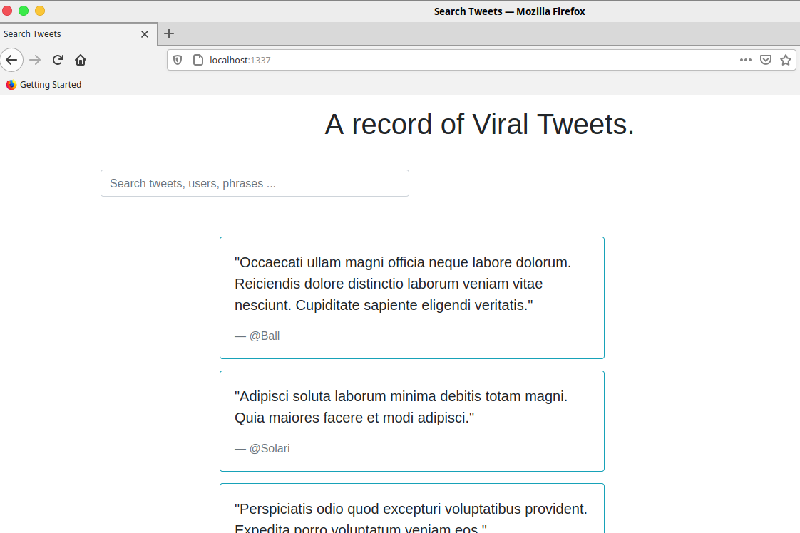
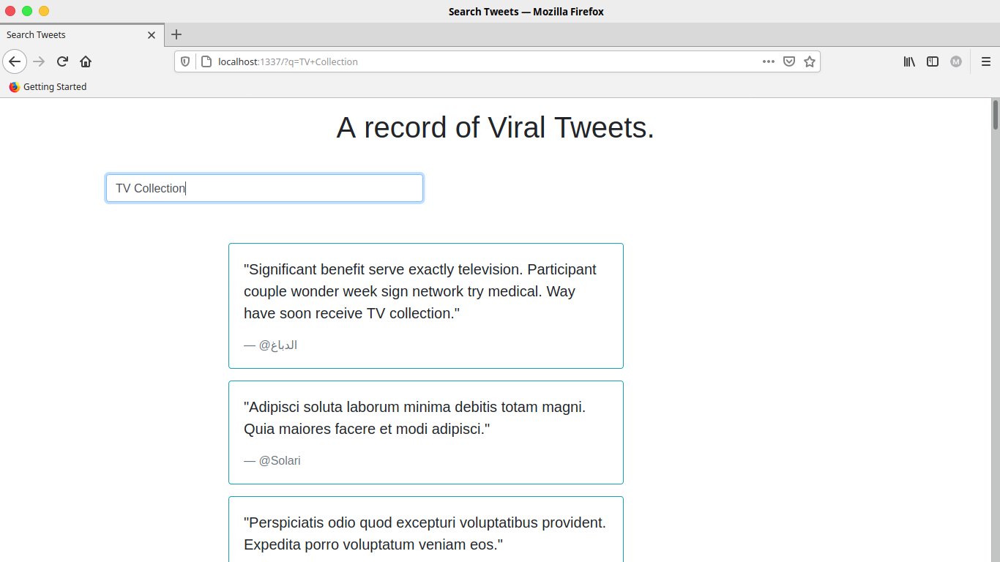

# A Django-Postgres Application Implementing Full Text Search.
## 0.0  How to Run the Application.
To download the repository run:
```bash
git clone https://github.com/mumoj/InterIntel-Response
```  

Then change directory into the Section-B folder:
```bash
cd Section-B/
```  

Make sure you've docker and docker compose installed to spin up the containers:
```
docker-compose up -d --build
```

Then makemigrations for the django models and migrate them:
```
docker-compose exec -w /home/app/web python manage.py makemigrations
docker-compose exec -w /home/app/web python manage.py migrate
```  

To populate the database with sample data run:
```
docker-compose exec -w /home/app/web python manage.py add_tweets
```
Then proceed to http://localhost:1337 to view the app's search page:
  

A search on search bar will yield results like below:


## 1.0 Project Setup.

### 1.1. Enviroment Setup.
First create the project folder and then a python virtual enviroment. Proceed to to activate the enviroment.
And then install the latest version of Django.
```bash
mkdir Section-B && cd Section-B
python3.6 -m venv/env
source venv/bin/activate
pip install django==3.25
```

### 1.2 Django Project Setup.
Then start the Django project and do the initial migrations of the bundled django models. Proceed to run the server to verify the installation is working properly. To do so, navigate to http://localhost:8000/ and check for the Django welcome screen.
```bash
django-admin startproject full_text_search.
python manage.py migrate
python manage.py runserver.
```

#### 2. Docker Setup.

### 2.1 Initial Django Dockerfile
Deactivate the python enviroment and create a Dockerfile in the /full_text_search directory.Then proceed to pull the official python3.6 alphine image. Then create a working directory for the Django application in the container.  
 Then set:  
	a) ENV PYTHONDONTWRITEBYTECODE 1 - To set that the python process doesn't write its initial write byte code on the disk  as it runs only once. Such byte code is written to be used by later invocations of the python process.  
	b) ENV PYTHONUNBUFFERED 1 - To ensure all python/django logs are sent to terminal even if crashes happen.   

Also, install pycopg2 dependencies and include pycopg2 in requirements.txt to facilitate the creation of the Postgres database.Then proceed to upgrade pip to ease installation of the other dependencies. Copy the requirements.txt from the Django project and install them. Then copy the Django project files into the container. 


```bash
# pull official base image
FROM python:3.6-alpine

# set work directory
WORKDIR /usr/src/app

# set environment variables
ENV PYTHONDONTWRITEBYTECODE 1
ENV PYTHONUNBUFFERED 1

# install psycopg2 dependecies
RUN apk update \
&& apk add postgresql-dev gcc python3-dev musl-dev

# install dependencies
RUN pip install --upgrade pip
COPY ./requirements.txt .
RUN pip install -r requirements.txt

# copy project
COPY . .
```  

### 2.2 Initial docker-compose.yml for Django.
In the root project folder create a docker-compose file to orchestrate the containers. In there define the django project folder,
the local server, the .env file, port and the directory in the docker container. Also set limits to how much of the localhost's memory is available to the container to prevent it from consuming all of it. 

``` bash
version: '3'

services:
  web:
    build: ./full_text_search
    command: python manage.py runserver 0.0.0.0:8000
    volumes:
      - ./app/:/usr/src/app/
    ports:
      - 8000:8000
    env_file:
      - ./.env.dev

    deploy:
      resources:
        limits:
          memory: 200M
        reservations:
          memory: 100M
```

Update the Django settings.py with the .env variables.The secret key is put in a .env file for security.

```python
SECRET_KEY = os.environ.get("SECRET_KEY")
DEBUG = int(os.environ.get("DEBUG", default=0))

ALLOWED_HOSTS = os.environ.get("DJANGO_ALLOWED_HOSTS").split(" ")

```
The env.dev file.
```
DEBUG=1
SECRET_KEY=foo
DJANGO_ALLOWED_HOSTS=localhost 127.0.0.1 [::1]

```
Then you can build an image with : ```docker-compose build``` whilst in  the project root directory.
To run the container detached from terminal run : ```docker-compose up -d```.

### 2.3 Django Database Setup.
Update the DATABASES dictionary in Django settings.py with Postgres settings defined in an .env file to replace the default sqlite database settings.

```python
DATABASES = {
    "default": {
        "ENGINE": os.environ.get("SQL_ENGINE", "django.db.backends.sqlite3"),
        "NAME": os.environ.get("SQL_DATABASE", os.path.join(BASE_DIR, "db.sqlite3")),
        "USER": os.environ.get("SQL_USER", "user"),
        "PASSWORD": os.environ.get("SQL_PASSWORD", "password"),
        "HOST": os.environ.get("SQL_HOST", "localhost"),
        "PORT": os.environ.get("SQL_PORT", "5432"),
    }
}               

```
The current state of the django .env.dev file:

```
DEBUG=1
SECRET_KEY='django-insecure-$@0b_zo=8149v$!k1^3#=a&9zc_ujs6hs92&+v&eds(e4el@5)'
DJANGO_ALLOWED_HOSTS=localhost 127.0.0.1 [::1]
SQL_ENGINE=django.db.backends.postgresql
SQL_DATABASE=text_search_db
SQL_USER=Mumo
SQL_PASSWORD=Mumo009
SQL_HOST=db
SQL_PORT=5432

```

### 2.4 Postgres Docker Setup.
In the root project docker-compose.yml, under services, write the script to build the Postgres container. In the script also define a volume for persisting data through containers.

```bash
db:
    image: postgres:12.0-alpine
    volumes:
        - postgres_data:/var/lib/postgresql/data/
    env_file:
        ./env.db

    deploy:
      resources:
        limits:
          memory: 100M
        reservations:
          memory: 50M
volumes:
    postgres_data:
```
The database configuration variables are stored in the ./env.db file as below.
```
POSTGRES_USER=Mumo
POSTGRES_PASSWORD=Mumo009
POSTGRES_DB=text_search_db
```

### 2.5 ENTRYPOINT for Postgres in the Django Dockerfile.
Write a bash script to ensure that the Postgres database is healthy and running before connecting to it with Django.
Also during development, flush the database and migrate anew every time you spin up the containers.
```bash
#!/bin/sh

if [ "$DATABASE" = "postgres" ]
then
    echo "Waiting for postgres..."

    while ! nc -z $SQL_HOST $SQL_PORT; do
      sleep 0.1
    done

    echo "PostgreSQL started"
fi

python manage.py flush --no-input
python manage.py migrate

exec "$@"
```
Proceed change permmissions of the bash file to allows its execution.

```bash
chmod +x full_text_search/entrypoint.sh
```
Finally add it to run at the and of the Django Dockerfile like so: ```ENTRYPOINT ["/usr/src/app/entrypoint.sh"]```.


At this point, you can run ```docker-compose up -d --build``` to spin up the two containers for development on the Localhost.
To view the logs for the project run ```docker-compose logs -f ```.


## 3.0 The Viral_tweet App

To create a Django app to implement the search functionality run: 
```bash
compose exec -w usr/src/app web python manage.py startapp viral_tweets
```
Proceed to the register your application in Django setting's INSTALLED_APPS dictionary as demonstrated below:
```python

INSTALLED_APPS = [
    'django.contrib.admin',
    'django.contrib.auth',
    'django.contrib.contenttypes',
    'django.contrib.sessions',
    'django.contrib.messages',
    'django.contrib.staticfiles',
    'django.contrib.postgres',
    
    # Local
    'viral_tweets.apps.ViralTweetsConfig'
]
``` 

### 3.1 Models.
Create a ViralTweet model in viral_tweets.models.py.

```python
# Create your models here.
class ViralTweet(models.Model):
    user_handle = models.CharField(max_length=50)
    tweet = models.TextField(max_length=1000)
``` 

Then makemigrations for the model: 
```bash
compose exec -w usr/src/app web python manage.py makemigrations viral_tweet
```
Then run the migrations:
```bash
compose exec -w usr/src/app web python manage.py migrate viral_tweet.
```
### 3.2  Views
Create a SearchResults view to process the search queries. The search query shall search for the phrase in both the 'user_handle' and 'tweet' fields in the ViralTweet model, then return a ranked list of the tweets based on how close the searched words appear.

```python
class SearchResults(ListView):
model = ViralTweet
context_object_name = "tweets"
template_name = "search_tweets.html"

def get_queryset(self):
    query = self.request.GET.get("q")

    if query:
        search_vector = SearchVector("user_handle") + SearchVector("tweet")
        search_query = SearchQuery(query)
        return (
            ViralTweet.objects.annotate(rank=SearchRank(search_vector, search_query))
            .order_by("-rank")
        )

    else:
        return ViralTweet.objects.all()

```

### 3.3 Urls
Define the url path for your search page in full_text_search.settings like below:
```python 
urlpatterns = [
    path('admin/', admin.site.urls),
    path('', SearchResults.as_view(), name='search-results'),
]

```

### 3.4 Templates and Static.
Create a folder named static within the viral_tweets module and put your bootstrap files in there. Create another folder
named templates and create your html templates.

_**base.html**_
Here you link to the bootstrap files in the static folder.
```html
<!DOCTYPE html>

<html>
<head>
	<meta charset="utf-8">
	<meta http-equiv="X-UA-Compatible" content="IE=edge">
	<title> Movie Reviews  </title>
	<link rel="stylesheet" href="">
	<script type="text/javascript" src=""></script>
</head>
<body>
	<div class="container border-dark">
		
	</div>
	
</body>
</html>
```  

_**search_tweets.html*_
This template shall inherit the base.html. It shall also loop over the 'tweets' queryset object from the SearchResults view to display them.
```html

 Search Tweets 

    <h1 class="text-gray-dark text-center py-3"> A record of Viral Tweets. </h1>

    <form class="form col-5 mx-2 pt-3 mb-5" action="" method="get">
        <input 
            type="search" 
            class="form-control" 
            name="q" 
            placeholder="Search tweets, users, phrases ..." >
    </form>

    
        
            <div class="row">
                <div class="col-6 offset-2">
                    <div class="card bg-transparent border-info my-2">
                        <div class="card-body">
                            <blockquote class="blockquote mb-0">
                                <p>"{{tweet.tweet}}"</p>
                                <footer class="blockquote-footer">{{tweet.user_handle}}</footer>
                            </blockquote>
                        </div>
                    </div>
                </div>
            </div>
        
        
    
        <div class="alert alert-info text-center col-5 offset-2 mt-5" role="alert">
            There are no tweets yet (-:
        </div>
    

```

## 4.0 Deployment on a Production Servers.
The site shall be deployed on a uwsgi/nginx server setup. The Nginx server shall act as a reverse proxy for the uwsgi
sever; meaning it shall sit between the uwsgi server and clients seeking the site's resources. It shall also serve the
site's static files.

### 4.1 Nginx Set Up
Create a nginx folder in the root project folder and add a Dockerfile. In there download the nginx alphine image, 
delete its default settings and replace them with custom ones. Also download the uwsgi_params file and copy it into the
nginx container.

```bash
FROM nginx:1.19.0-alpine

RUN rm /etc/nginx/conf.d/default.conf
COPY nginx.conf /etc/nginx/conf.d

COPY uwsgi_params /etc/nginx/uwsgi_params
```
_**Custom Nginx Config file**_
This file defines the port to listen to the uwsgi server from in the 'upstream django' section. It also defines Nginx
own port,server_name, as well as the address of the site's static files and the address of the main site.  
```editorconfig
upstream django {
    server web:8000;
}

server {
    listen 80;
    listen [::]:80 default_server;
    server_name  localhost;

    location /static/  {
        alias /home/app/web/staticfiles/;
    }

    location / {
        include /etc/nginx/uwsgi_params;
        uwsgi_pass django;   
    }
}
```

### 4.2 uWSGI Set Up.
First, add the following dependencies to the django project docker file:
```
# Install uWSGI server dependencies
RUN apk update \
    && apk add linux-headers pcre-dev
```

Then add uwsgi to requirements.txt and the uwsgi.ini file to the django project folder. The uwsgi.ini file defines 
the location of the wsgi.py module,the number of processes(workers) to assign to the server, the server's socket, 
the file to write the server's PIDs and whether to clean up temporary files/sockets created on 
shutdown of the server(the vacuum option.). It also has the master option which defines a master process for managing
the respwaning of workers.

```ini
[uwsgi]
 
module = full_text_search.wsgi
master = True
processes = 4

socket = :8000 #Port number 

pidfile = master.pid
vacuum = True
```

## 5.0  The Final Django Project Dockerfile
After installing all the dependencies and creating the neccessary project folders in the docker container, ownership of
the project is changed to a user with non-root access. This is to prevent any attackers from gaining access to the 
host machine were they to break into the container.
```bash
# syntax = docker/dockerfile:1.2 # Enable BUILDKIT caching.
# pull official base image
FROM python:3.6-alpine

# set work directory
WORKDIR /usr/src/app

# set environment variables
ENV PYTHONDONTWRITEBYTECODE 1
ENV PYTHONUNBUFFERED 1

# Install psycopg2 dependencies
RUN apk update \
    && apk add postgresql-dev gcc python3-dev musl-dev

# Install uWSGI server dependencies
RUN apk update \
    && apk add linux-headers pcre-dev

# install Django dependencies and cache them
COPY ./requirements.txt .
RUN --mount=type=cache,target=/root/.cache \
    pip  install -r requirements.txt

# create directory for the app user
RUN mkdir -p /home/app

# create the app user
RUN addgroup -S app && adduser -S app -G app

# create the appropriate directories
ENV HOME=/home/app
ENV APP_HOME=/home/app/web
RUN mkdir $APP_HOME

# create staticfiles folder
RUN mkdir $APP_HOME/staticfiles 
WORKDIR $APP_HOME

# Copy Django project.
COPY . $APP_HOME

# copy entrypoint.sh
COPY ./entrypoint.sh $APP_HOME

# chown all the files to the app user
RUN chown -R app:app $APP_HOME

# change to the app user
USER app

# run entrypoint.sh
ENTRYPOINT ["/home/app/web/entrypoint.sh"]
```

## 6.0 The Final Docker-Compose file.
A Nginx container is finally defined with its port, a volume for static files and memory limitations. The command for
running the web app is also changed to uwsgi. Also change the .env file for  the web app to the production one to disable
debugging mode. 

```bash
version: '3'

services:

  web:
    build: ./full_text_search
    command: uwsgi --ini uwsgi.ini

    volumes:
      - static_volume:/home/app/web/staticfiles
    expose:
      - 8000
    env_file:
      - ./.env.dev
    depends_on:
      - db

    deploy:
      resources:
        limits:
          memory: 200M
        reservations:
          memory: 100M

  db:
    image: postgres:12.0-alpine
    volumes:
      - postgres_data:/var/lib/postgresql/data/
    env_file:
      - ./.env.db

    deploy:
      resources:
        limits:
          memory: 100M
        reservations:
          memory: 50M

  nginx:

    build: ./nginx
    volumes:
      - static_volume:/home/app/web/staticfiles
    ports:
      - 1337:80
    depends_on:
      - web

    deploy:
      resources:
        limits:
          memory: 100M
        reservations:
          memory: 50M

volumes:
  postgres_data:
  static_volume:


```